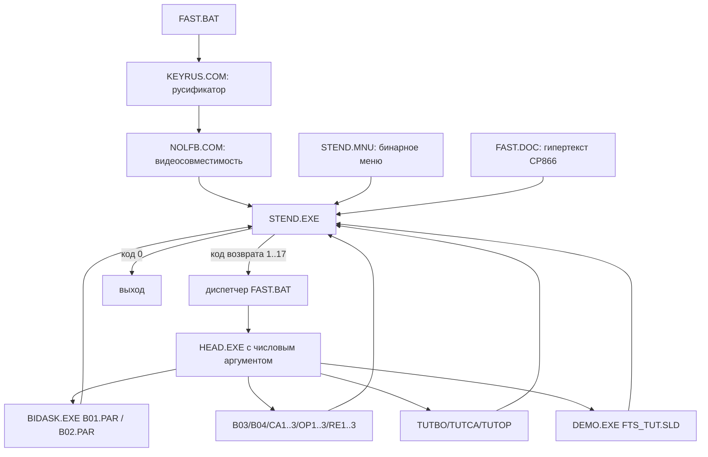

# FAST: восстановленное поведение оригинала

Источник истины: `../fik.img`, FAT12, 1 474 560 байт. Извлечено 35 файлов,
1 428 010 байт полезных данных. Оригиналы сохранены в `data/original/`.
Это отчёт об исследовании и текущем состоянии переноса, **не утверждение о
готовности Python-копии**. Полные тексты, включая таблицы сценариев, находятся
в `data/converted/FAST.DOC.txt`; конфигурации и строки EXE — рядом.

## Статус Python-переноса

Меню, ручной браузер FAST.DOC, оглавление и отдельная демонстрация двойного
аукциона перенесены в Python. Все 17 оригинальных пунктов запуска доступны,
а пользовательские уровни добавляются отдельной вкладкой.
B01/B02 используют общий восстановленный BIDASK с исходными PAR. B03/B04,
CA1/2/3, OP1/2/3, RE1/2/3 и TutBO/TutCA/TutOP имеют рабочие DOS-подобные
экраны с редактированием параметров, расчётом восстановленных из документации
формул и просмотром полного текста раздела клавишей `D`. Автономные роботы
BIDASK пока отключены: их Real48-ветви не подтверждены дизассемблированием.
Для остальных EXE исходные автономные значения и часть округлений помечены
ниже как UNKNOWN; экран использует только опубликованные в FAST.DOC данные.

## 1. Устройство и запуск

Это комплект отдельных программ, а не один исполняемый симулятор.

Возврат к STEND выполняет именно BAT, не дочерний EXE. Команды `rem B01`,
`rem CA1` и т. п. являются комментариями. Запуск выполняет HEAD.
HEAD также обеспечивает служебное присутствие в памяти: прямой запуск
BIDASK завершается с кодом 1 до заставки, вызов `HEAD 11` работает.
В BIDASK есть поиск сигнатуры FAST-Center по векторам INT 60h..67h.
Образ подключался как A:, рабочие файлы — отдельной копией как C:.

| Код STEND | Аргумент HEAD | Назначение |
|---:|---:|---|
| 1 | 0 | DEMO FTS_Tut — знакомство с двойным аукционом |
| 2 | 11 | BIDASK B01.par |
| 3 | 12 | BIDASK B02.par |
| 4 | 13 | B03 |
| 5 | 14 | B04 |
| 6 | 10 | TUTBO |
| 7 | 21 | CA1 |
| 8 | 22 | CA2 |
| 9 | 23 | CA3 |
| 10 | 20 | TUTCA |
| 11 | 31 | OP1 |
| 12 | 32 | OP2 |
| 13 | 33 | OP3 |
| 14 | 30 | TUTOP |
| 15 | 41 | RE1 |
| 16 | 42 | RE2 |
| 17 | 43 | RE3 |

## 2. Главное меню

Ресурс STEND.MNU содержит верхнюю строку:
`Информация   Торги   Облигации   Акции   Опционы   Эффективность   Конец`.

* Информация: инструкция / сведения о FAST.
* Торги: инструкция и знакомство с двойным аукционом.
* Облигации: Case B01, B02, B03, B04, Дюрация.
* Акции: Case CA1, CA2, CA3, Портфель акций.
* Опционы: Case OP1, OP2, OP3, Опционы.
* Эффективность: Case RE1, RE2, RE3.
* Конец: `Вы завершаете работу? Да Нет`.

В разделе `Торги` есть пункты `Инструкция` и `Знакомство` с двойным аукционом.
Для кейсов есть подменю `Описание игры` / `Торговая сессия`.
Строки и иерархия подтверждены ресурсом; точные клавиши, переходы по буквам,
координаты меню и все связи гипертекста ещё требуют проверки на оригинале.
Не следует автоматически приписывать STEND управление F1–F10 из других EXE.

## 3. Общие правила торгового движка

Источник: FAST.DOC, раздел «Описание Торговой Системы»; применимость каждой
детали к автономному BIDASK требует отдельной проверки — руководство также
описывает сетевую учебную систему.

* Двойной аукцион. Предложения — цена и количество. `20.50` значит 50 бумаг
  по цене 20, а не дробную цену 20,50.
* В базовом варианте новый bid строго выше текущего, новый ask строго ниже.
  При отсутствии предложения разрешена любая положительная цена.
* `B` принимает чужой ask, `S` принимает чужой bid. Вводится количество.
  Нельзя торговать с собой, количество не превышает объём текущего предложения.
* Документация описывает явное принятие заявки. Автоматическое исполнение
  пересекающихся bid/ask **не установлено**.
* Стрелки выбирают бумагу и колонку. Enter отправляет ввод, Backspace исправляет,
  Esc очищает незавершённый ввод. Esc не следует считать безусловным выходом.
* Свои заявки зелёные, чужие жёлтые по руководству; цвета текущего автономного
  BIDASK необходимо сверять отдельно.
* При покупке `cash -= price * quantity`, `position += quantity`;
  у продавца изменения противоположны. Правила резервирования средств не известны.
* Базовый режим не восстанавливает вытесненное предложение. Ранговая очередь
  сортирует bid по убыванию, ask по возрастанию и восстанавливает следующее
  предложение после исполнения/отмены. Глубина, равные цены и механизм отмены
  в BIDASK пока не восстановлены.
* Отображаются три последние сделки выбранной бумаги; подробности хранения
  истории и графиков требуют анализа.

### Реальный экран BIDASK

DOSBox-X, VGA, 640×480, 16-цветный стиль BGI. Сверху белая полоса
`Торговая сессия  Рынок облигаций`, ниже попытка, период и оставшиеся секунды.
Слева сверху названия бумаг, серое торговое поле с красной рамкой,
колонки покупка/продажа/количество. Ниже деньги и процент. Подсказка F9
открывает фиолетовое поле справа от таблицы. Внизу белая полоса клавиш:
`↑ ↓ → ← Выбор B Покупка S Продажа + Быстро - Медленно F9 Цены E Выход`.
Центральная и нижняя части отведены истории/графику. Заставка — синяя, начало
по пробелу. После попытки: `Достигнутые результаты`, `Q — Окончание игры`,
`ПРОБЕЛ — Новая попытка`.

Снимки: `tests/reference_cases/captures/b01_intro_full.png`, `b01_replay.png`,
`b01_short_results.png`. Шрифт BGI выглядит как растровый 8×8, некоторые надписи
увеличены; извлечение собственного шрифта пока не выполнено.

## 4. B01 — купонные и бескупонные облигации

**Цель:** освоить двойной аукцион и увеличить итоговые деньги.

**Начальные параметры из B01.PAR:** 3 периода по 1200 десятых секунды (120 с),
ставки 25/25/25 процентов. Деньги 1000, CpBnd 15, ZeroCp 0.

| Бумага | Выплата 1 | Выплата 2 | Выплата 3 |
|---|---:|---:|---:|
| CpBnd | 20 | 20 | 120 |
| ZeroCp | 0 | 0 | 100 |

Очки: четыре значения `0 0 10000 6`; очередь 1; роботов 10, из них волков 3;
реакция 60 десятых секунды (6 с); стратегия 1; F9 включена.

**Действия и интерфейс:** общий BIDASK, обе бумаги доступны для заявок и сделок.
Разрешены займы и короткие позиции. F9 в периоде 1 показывает 90.240 и 51.200.

**Расчёт конца периода:** сначала `C = C * (1 + r/100)`, затем
`C += sum(q[i] * payment[i, period])`. Отрицательные позиции дают отрицательные
выплаты, отрицательные деньги увеличивают долг. Будущие купоны ещё не выплачены.

**Оценка бумаги:** код 0x1722..0x18F4 считает стоимость оставшегося потока через
последовательное накопление и деление на произведение будущих множителей ставок.
Это эквивалентно сумме дисконтированных платежей, но порядок вычислений важен
для округления шестибайтного Real.

**Изменения во времени:** обратный отсчёт, решения роботов, границы периодов,
ожидание продолжения по пробелу. Точный порядок совпадающих событий не установлен.

**Завершение:** после третьего периода оценка попытки и таблица результатов.
Руководство обещает до 20 попыток, порог 9999 и максимум 6 очков. В конфигурации
порог 10000; точные ветви начисления очков и ограничение попыток ещё не доказаны.

**Проверка оригиналом:** длительность изменена только в рабочей копии на 30
десятых секунды; действий торговли нет. Таблица оригинала показывает
`4597 / 4597 / 4597`, очки `2.76`. Числа по периодам — оценка финального дохода,
а не остаток денег на каждой границе. По документированным выплатам остатки:
1550, 2237.5, 4596.875. Экран показывает округлённые данные; скрытую точность
этим экспериментом проверить нельзя.

## 5. B02 — переменная процентная ставка

**Цель:** оценка потока при изменяющихся по годам ставках.
Тот же EXE, интерфейс, действия и расчёт выплаты, что у B01.
3 периода по 120 с; ставки 4/10/16%; деньги 1000; позиции 10/5/5/40.

| Бумага | Выплата 1 | Выплата 2 | Выплата 3 |
|---|---:|---:|---:|
| CpBnd | 10 | 10 | 110 |
| ZCp1 | 100 | 0 | 0 |
| ZCp2 | 0 | 100 | 0 |
| ZCp3 | 0 | 0 | 100 |

Очки `0 0 10000 6`; очередь 1; роботов 10, волков 2; реакция 6 с;
стратегия 1; F9 включена. После третьего года определяется итоговый капитал.
Без сделок по формулам документа: 1640 → 2404 → 7888.64.
Поведение погашенной бумаги в оставшихся торговых периодах надо проверить.

## 6. Другие торговые модули

Ниже восстановлена **документированная спецификация**, а не доказана точная
реализация EXE. Полные исходные таблицы не заменены пересказом: они сохранены
в FAST.DOC.txt и в `data/converted/manual_sections.json`.
Для каждого из этих EXE остаются UNKNOWN: автономные начальные значения,
длительность, число/алгоритмы роботов, все горячие клавиши и точность округлений,
если ниже явно не указано иначе. Однобайтные PAR содержат `#` (0x23), это не
полноценные конфигурации по формату BIDASK.

| Модуль | Цель, начальные данные и действия | Время, расчёты, окончание и результат |
|---|---|---|
| B03 | Облигации и фьючерсы. 4 облигации, 2 фьючерса, деньги. Облигации как B02. Разрешены короткие позиции. | 3 года, ставки 4/10/16. При заключении фьючерса деньги не переводятся. Поставка в срок; описанный контракт фактически форвардный, без ежедневной переоценки. Итог после 3-го года, до 6 очков. Точные автономные позиции неизвестны. |
| B04 | Иммунизация. Два торгуемых актива с потоками (0,160,200,250) и (30,100,47,0); обязательства по двум неторгуемым zero-coupon с выплатой 100 во 2-м или 3-м году. Два типа трейдера. | Торги только в первом году. Ставка 25%, затем равновероятно 5/15/25/35/45% на оставшиеся три года. В конце первого года переоценка всего будущего потока по реализованной ставке. Руководство: ≤5000 — 0, ≥9999 — 8, между ними `4+4*(C-5000)/(9999-5000)`; разрыв у 5000 нельзя самовольно исправлять. |
| CA1 | Управление риском. 3 акции, 10 равновероятных состояний. Начальные позиции типов 1..4: (316,24,52;-8084), (78,100,52;-3354), (78,24,210;-5364), (0,0,0;4200). Запрещена короткая позиция в акциях; денежный кредит разрешён. | Один год, ставка 12%. Портфель ликвидируется по выбранному состоянию. Премиальная граница типов 1..3: round(2.105031*(C-0.0000525*C²)); типа 4: round(1.282015*(C-0.000022*C²)). Затем 25 лотерей 1..10000, выигрыш 0.20 за успех. Порядок ограничения границ и округления требует EXE. |
| CA2 | Продолжение CA1. Нельзя выставлять заявки: только покупки/продажи по фиксированным ценам 28,26,25; bid=ask. | Состояния экономики и риск как CA1 по документации. Один год, переоценка и премиальная лотерея. Соответствие автономных констант ещё не проверено. |
| CA3 | Склонность к риску. Модификация CA1, короткие позиции разрешены. | Премиальная граница типов 1..3: round(0.6557603*(C+0.0000525*C²)); типа 4: round(0.3125215*(C+0.00022*C²)). Остальная схема лотереи как CA1. |
| OP1 | Однопериодные европейские опционы. Акция по внешней цене 20; облигация с выплатой 101; put/call со страйком 25. По акции только B/S, по остальным рынкам заявки. Кредит и shorts разрешены. | Один месяц. sigma=2.40, mu=.12; u=exp(sigma/sqrt(12)), d=1/u, p=(exp(mu/12)-d)/(u-d). Опционы автоматически исполняются в конце; выплаты max(K-S,0), max(S-K,0). Деньги под 1% за месяц. До 4 очков, C/9999*4. |
| OP2 | Двухпериодные опционы. Начальная акция 20, страйк 25, облигация платит 102 после двух месяцев. Действия как OP1. | 2 месяца, независимые переходы u/d. Цена акции во втором периоде зависит от первого исхода. 1% на деньги каждый период, опционы исполняются после второго. До 4 очков; текст раздела очков ошибочно называет попытку одним периодом. |
| OP3 | Дельта-хеджирование. Акция 400, sigma=.30, mu=.12, страйк 410, облигация платит 103. В таблице типов: put=-1210/cash=30031 либо call=-1220/cash=32855; акция и bond=0. По опционам торги запрещены; можно торговать акцией и bond. | 3 месяца; u=exp(.30/sqrt(12)), d=1/u. 1% на деньги за период. Финальные put/call выплаты. C<500 — 0 очков; 500..10000 — `8+(C-500)/9500`; от 10000 — 9. Текстовое обозначение типов A/B не совпадает очевидным образом с таблицей 1/2. |
| RE1 | Информационная эффективность. Фирмы BHP и CRA, частные сообщения вида Not z/Not y исключают события. Торговля по двойному аукциону. | 2 года. Дивиденды после первого, окончательная цена после второго; таблицы в исходном разделе. Кредит и shorts разрешены, ставка 0. Капитал определяет премиальную границу: 25 лотерей с выигрышем .20. |
| RE2 | Эффективность портфеля. 3 фирмы, первая независима от двух других; успех 2-й означает неудачу 3-й. Частная информация исключает события. | 2 года, дивиденды в первом, ликвидация во втором; ставки 0, кредит и shorts разрешены. Матрицы выплат отличаются от RE1. Лотерея как RE1. |
| RE3 | Роль опционов при неодинаковой информации. 2 независимые фирмы, put/call на первую со страйком 30, частные исключения событий. | 2 периода. Обе фирмы: финальные цены по строкам событий первого года (0,20,40), (0,25,45), (0,35,60). Дивиденды первого года 0. Европейские опционы истекают после второго. Ставка 0, результат через 25 лотерей. |

В CA1 исходные векторы десяти конечных цен:
`[5,5,5,24,25,30,32,68,75,75]`,
`[4,5,10,21,66,65,65,20,20,20]`,
`[55,55,49,22,22,20,10,10,10,10]`.

## 7. Учебные модули

Это интерактивные расчётные программы, а не одинаковые торговые сессии.
Для них нельзя механически использовать экран BIDASK и его таймер.

### TUTBO — «Дюрация: Составьте Портфель»

Один кадр: таблица потоков трёх облигаций, ставка, шаг/число шагов графика,
количества, доли, дюрация, цена, стоимость и деньги. Первые две бумаги — актив,
третья — обязательство. Цель — подобрать иммунизирующий портфель.
Стрелки выбирают редактируемое поле, Enter пересчитывает; полное заполнение поля
также запускает пересчёт. F10 переключает два исходных типа из B04, Q выходит.
Редактируемые числа белые, результаты жёлтые. Стоимость = цена × количество,
деньги = стоимость пассива − стоимость актива. При изменении долей сохраняется
суммарное количество облигаций, а не стоимость! График — итог в конце четвёртого
периода при разных ставках; положительное зелёное, отрицательное красное.
Не восстановлены из EXE начальные числовые таблицы, единицы дюрации (в подписи
руководства «мес.»), ограничения ввода, округление и точная формула дюрации.

### TUTCA / TutCAPM

Шесть кадров: анализ ситуации, конкурентное равновесие, позиции трейдеров 1..4.
F1..F6 меняют кадр, F10 восстанавливает исходные данные, Enter пересчитывает,
стрелки выбирают поле, Q выходит. Параметры: вероятности десяти сценариев,
будущие цены трёх компаний, текущие цены, ставка, запасы и число трейдеров,
параметр полезности c*10000. Результаты: ожидаемые доходности/риск,
рыночный портфель, CAPM-цены, равновесные запасы, капитал, полезность и очки.
Графики риск–доходность/CML и капитал–полезность. Требуются положительные c
и положительное суммарное число акций компании. Точные алгоритмы решения
равновесия, численная устойчивость и реакция на вырожденность пока UNKNOWN.

### TUTOP — опционные стратегии

Три кадра: сравнение трёх опционных портфелей, опционные стратегии, желательный
график. Акция плюс пять call и пять put с разными страйками. F1..F3 — кадры,
F9 — примеры портфелей в первом кадре / автопостроение во втором, F10 — сброс,
Enter и стрелки — ввод, Q — выход. Белое редактируется, жёлтое вычисляется.
Цены опционов связаны с моделью Блэка–Шоулза; график показывает доход портфеля
от будущей цены акции. Есть стрэдлы, стрэнглы, спрэды, бабочки и другие шаблоны.
Можно задать желательный график и искать портфель автоматически. Точный набор
позиций шаблонов, аппроксимация нормального распределения, алгоритм оптимизации,
ограничения ввода и исходные значения требуют анализа TUTOP.EXE.

## 8. Роботы и случайность

Число роботов и волков явно задаётся PAR, это не число всех участников вместе
с человеком. В коде BIDASK массивы включают отдельную позицию игрока (индекс 0),
циклы роботов начинаются с 1.

При инициализации периода первые `wolves` роботов получают оценку из функции
0x1722 (дисконтирование). Остальные — случайную оценку между 0.8 и 1.2 от неё:
0x62A7..0x638B. Первичная оценка до этого задаётся случайно до 999:
0x6014..0x6021. Случайный интервал реализован в 0x123F..0x12C4.

Этого **недостаточно для реализации роботов**: ещё не восстановлены ветви
стратегии 0/1, момент и порядок выбора робота, изменение оценки после сделки,
правила формирования цены/объёма заявки и выбора принятия чужой заявки.
Подменять их «разумным маркет-мейкером» нельзя.

RNG в 0xC758..0xC78D: `state = (state * 0x08088405 + 1) mod 2**32`.
Real Random() в 0xC71F использует этот state как долю от 2**32.
Начальное значение в образе данных равно 0. Найдены прямые вызовы Random()
в 0x1280 и 0x6014. Подпрограмма установки seed по DOS-времени присутствует,
но её вызов в приложении не установлен. Полная последовательность вызовов
по действиям пользователя и таймеру ещё не восстановлена.

## 9. Что не является проверкой совместимости

RESULTS — таблица результатов учебной сессии в Минске 25 мая — 3 июня 1995 г.,
а не журнал заявок или golden dataset автономного BIDASK. PROBLEMS — задачи
по пяти темам, а не параметры роботов. FTS_TUT.SLD — бинарные учебные слайды.
Одного совпадения цены F9 или финального округлённого капитала недостаточно
для объявления B01 готовым. Для остальных модулей нет полного воспроизведения
поведения в Python; состояния UNKNOWN перечислены в REVERSE_ENGINEERING.md.

## 10. Текущее состояние Python-переноса

`market.config` читает оригинальные B01/B02.PAR без преобразования формата.
`market.calculations` воспроизводит наблюдаемые цены F9, начисление ставки и
подтверждённое DOS-округление произведения выплаты к знаковому 16-битному
слову. `market.orderbook` и `market.engine` реализуют двойной аукцион,
строгое улучшение Bid/Ask, ранговую LIFO-очередь, сделки, позиции и границу
периода. Экран `modules.bidask` открывается из меню для B01/B02 и использует
оригинальный CP866 bitmap-шрифт. Раздел `Торги → Знакомство` перенесён как
пошаговый урок по тексту `FTS_TUT.SLD`: он воспроизводит обязательные подсказки,
заявки 50.10/33.1/54.99/123.5, покупки 8/42, продажи 5/90, очередь, короткую
позицию и расчёты периода. Решения роботов сознательно не запускаются,
пока не проверены все ветви Real48; остальные модули остаются описательными.
